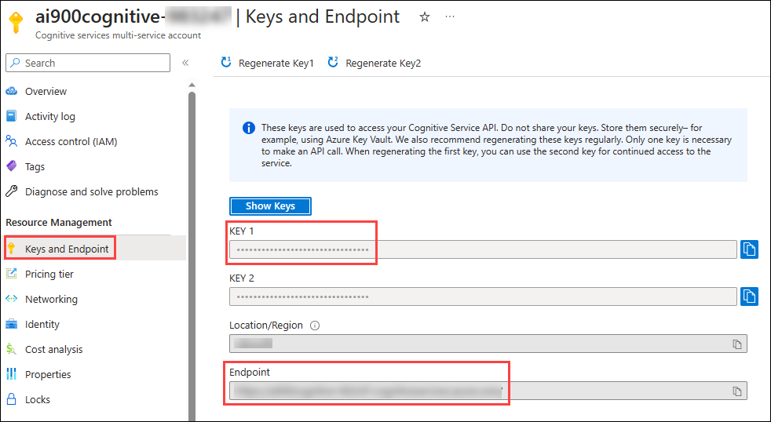
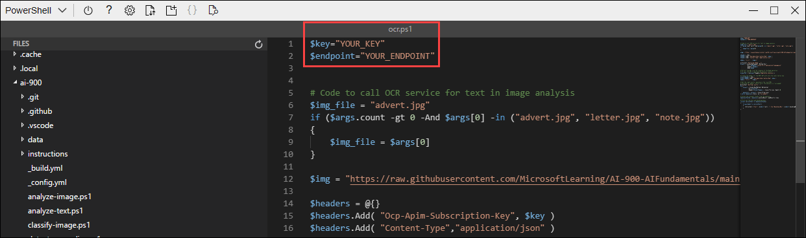

# Module 03d: Explore optical character recognition

A common computer vision challenge is to detect and interpret text in an image. This kind of processing is often referred to as *optical character recognition* (OCR). Microsoft's Read API provides access to OCR capabilities. 

To test the capabilities of the Read API, we'll use a simple command-line application that runs in the Cloud Shell. The same principles and functionality apply in real-world solutions, such as web sites or phone apps.

In this lab, you will:
- Create an Azure Cognitive Service and Azure Storage Account.
- Configure and run a client application.

## Exercise 01: Use the Computer Vision Service to Read Text in an Image

The **Computer Vision** cognitive service provides support for OCR tasks, including:

- A **Read** API that is optimized for larger documents. This API is used asynchronously, and can be used for both printed and handwritten text.

## Task 1: Create a *Cognitive Services* resource

You can use the Computer Vision service by creating either a **Computer Vision** resource or a **Cognitive Services** resource.

1. In the Azure Portal click the **&#65291;Create a resource** button.

   
   
1. In the Marketplace page search for **Cognitave Services** and Select **Cognitive Services**.

    
     
1. On Cognitive Services Page Click on **Create**. 
     
     

1. Create a **Cognitive Services** resource with the following settings:
    - **Subscription**: *Retain the Existing Subscription*.
    - **Resource group**: Select **AI-900-Module-03d-<inject key="DeploymentID" enableCopy="false"/>**
    - **Region**: **<inject key="location" enableCopy="false"/>**
    - **Name**: Enter **ai900cognitive-<inject key="DeploymentID" enableCopy="false"/>**
    - **Pricing tier**: Standard S0
    - **By checking this box I acknowledge that I have read and understood all the terms below**: Select the checkbox.
    
    
1. Click on **Review + Create**.

      
   

1. After successfully completing the validation process, click on the **Create** button located in the lower left corner of the page.

1. Wait for deployment to complete(it can take a few minutes), and then click on the **Go to resource** button, this will take you to your Cognitive Service.

1. View the **Keys and Endpoint** page for your Cognitive Services resource. Copy and save the **KEY 1** and **Enpoint** value to NotePad for future reference to connect from client applications. 

    

## Task 2: Run Cloud Shell

To test the capabilities of the Custom Vision service, we'll use a simple command-line application that runs in the Cloud Shell on Azure.

1. In the Azure portal, select the **[>_]** (*Cloud Shell*) button at the top of the page to the right of the search box. This opens a Cloud Shell pane at the bottom of the portal. 

    .png)

1. The first time you open the Cloud Shell, you may be prompted to choose the type of shell you want to use (*Bash* or *PowerShell*). Select **PowerShell**. If you do not see this option, skip the step.  

1. If you are prompted to create storage for your Cloud Shell, ensure your subscription is selected and click on **show advanced settings**. Please make sure you have selected your resource group **AI-900-Module-03d-<inject key="DeploymentID" enableCopy="false"/>** and enter **blob<inject key="DeploymentID" enableCopy="false"/>** for the **Storage account name** and enter **blobfileshare<inject key="DeploymentID" enableCopy="false"/>** For the **File share name**, then click on **Create Storage**.

    

1. Make sure the the type of shell indicated on the top left of the Cloud Shell pane is switched to *PowerShell*. If it is *Bash*, switch to *PowerShell* by using the drop-down menu.

    .png)

1. Wait for PowerShell to start. You should see the following screen in the Azure portal:  

    .png)

## Task 3: Configure and run a client application

Now that you have a custom model, you can run a simple client application that uses the OCR service.

1. In the command shell, enter the following command to download the sample application and save it to a folder called ai-900.

    ```PowerShell
    git clone https://github.com/MicrosoftLearning/AI-900-AIFundamentals ai-900
    ```

1. The files are downloaded to a folder named **ai-900**. Now we want to see all of the files in your Cloud Shell storage and work with them. Type the following command into the shell:

    ```PowerShell
    code .
    ```

    Notice how this opens up an editor like the one in the image below: 

    .png)

1. In the **Files** pane on the left, expand **ai-900** and select **ocr.ps1**. This file contains some code that uses the Computer Vision service to detect and analyze text in an image, as shown here:

    

1. Don't worry too much about the details of the code, the important thing is that it needs the endpoint URL and either of the keys for your Cognitive Services resource. Copy these from the **Keys and Endpoints** page for your resource (Task 1, Step 8) and paste them into the code editor, replacing the **YOUR_KEY** with *KEY 1* and **YOUR_ENDPOINT** with *Enpoint* placeholder values, respectively.

  
    > **Tip**: You may need to use the separator bar to adjust the screen area as you work with the **Keys and Endpoint** and **Editor** panes.

    After pasting the key and endpoint values, the first two lines of code should look similar to this:

    
    > $key="1a2b3c4d5e6f7g8h9i0j...."    
    > $endpoint="https..."
    

1. After making the changes to the variables in the code, press **CTRL+S** to save the file. Then press **CTRL+Q** to close the code editor. Now that you've set up the key and endpoint, you can use your Cognitive Services resource to extract text from an image.

    Let's use the **Read** API. In this case, you have an advertising image for the fictional Northwind Traders retail company that includes some text.

    The sample client application will analyze the following image:

    

1. In the PowerShell pane, enter the following commands to run the code to read the text:

    ```PowerShell
    cd ai-900 
    ```

     ```PowerShell
    ./ocr.ps1 advert.jpg
    ```

1. Review the details found in the image. The text found in the image is organized into a hierarchical structure of regions, lines, and words, and the code reads these to retrieve the results.

    Note that the location of text is indicated by the top- left coordinates, and the width and height of a *bounding box*, as shown here:

    

1. Now let's try another image:

    

    To analyze the second image, enter the following command:

    ```PowerShell
    ./ocr.ps1 letter.jpg
    ```

1. Review the results of the analysis for the second image. It should also return the text and bounding boxes of the text.

**Congratulations** on completing the task! Now, it's time to validate it. Here are the steps:

  > - Navigate to the Lab Validation tab, from the upper right corner in the lab guide section.
  > - Hit the Validate button for the corresponding task. If you receive a success message, you can proceed to the next task. 
  > - If not, carefully read the error message and retry the step, following the instructions in the lab guide.
  > - If you need any assistance, please contact us at [labs-support@spektrasystems.com](labs-support@spektrasystems.com).We are available 24/7 to help you out.

### You have successfully completed this lab.

## Learn more

This simple app shows only some of the OCR capabilities of the Computer Vision service. To learn more about what you can do with this service, see the [OCR page](https://docs.microsoft.com/azure/cognitive-services/computer-vision/overview-ocr).
