# Module 04: Explore text analytics

Natural Language Processing (NLP) is a branch of artificial intelligence (AI) that deals with written and spoken language. You can use NLP to build solutions that extract semantic meaning from text or speech, or that formulate meaningful responses in natural language.

Microsoft Azure *Cognitive Services* includes the text analytics capabilities in the *Language* service, which provides some out-of-the-box NLP capabilities, including the identification of key phrases in text, and the classification of text based on sentiment.

For example, suppose the fictional *Margie's Travel* organization encourages customers to submit reviews for hotel stays. You could use the Language service to summarize the reviews by extracting key phrases, determine which reviews are positive and which are negative, or analyze the review text for mentions of known entities such as locations or people.

To test the capabilities of the Language service, we'll use a simple command-line application that runs in the Cloud Shell. The same principles and functionality apply to real-world solutions, such as websites or phone apps.

## Exercise 1: Create a *Cognitive Services* resource

### Task 1: Create a *Cognitive Services* resource

You can use the Computer Vision service by creating either a **Language** resource or a **Cognitive Services** resource.

If you haven't already done so, create a **Cognitive Services** resource in your Azure subscription.

1. In the Azure Portal click the **&#65291;Create a resource** button.

     
   
1. In the Marketplace page search for **Cognitive Services** and Select **Cognitive Services** 

     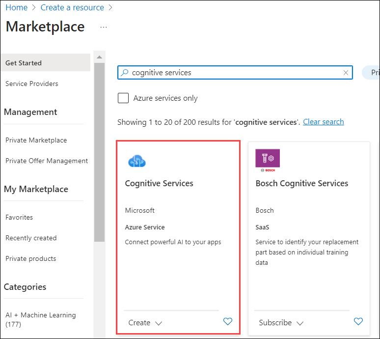
     
1. On Cognitive Services Page Click on **Create**. 
     
     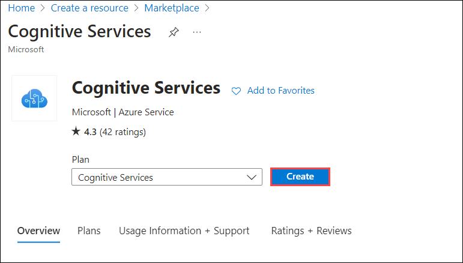
    
3. Create a **Cognitive Services** resource with the following settings:

    - **Subscription**: Use existing subscription. **(1)**
    - **Resource group**: Select **AI-900-Module-04-<inject key="DeploymentID" enableCopy="false"/> (2)**
    - **Region**:  Select **<inject key="location" enableCopy="false" /> (3)**
    - **Name**: Enter **ai900cognitive-<inject key="DeploymentID" enableCopy="false"/> (4)**
    - **Pricing tier**: Standard S0 **(5)**
    - **By checking this box I acknowledge that I have read and understood all the terms below**: Select the checkbox. **(6)**
    
1. Click on **Review + Create (7)**.

      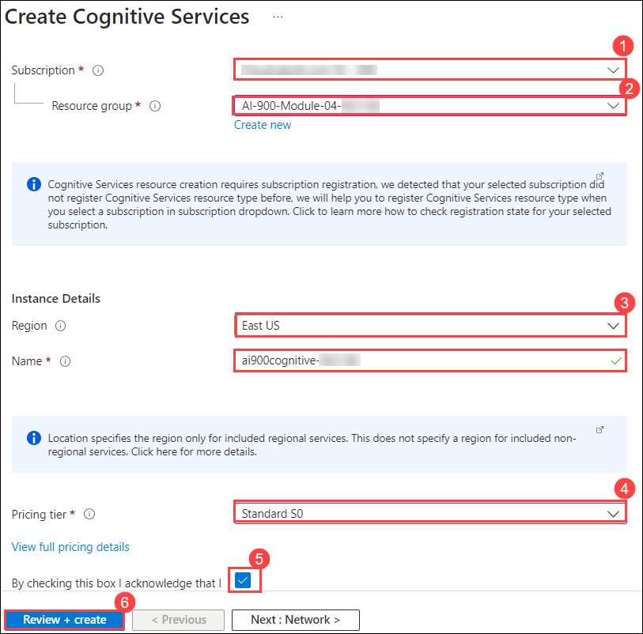
   
1. After successfully completing the validation process, click on the **Create** button located in the lower left corner of the page.

1. Wait for deployment to complete(it can take a few minutes), and then click on the **Go to resource** button, this will take you to your Cognitive Service.

1. View the **Keys and Endpoint** page for your Cognitive Services resource. You will need the endpoint and keys to connect from client applications.

      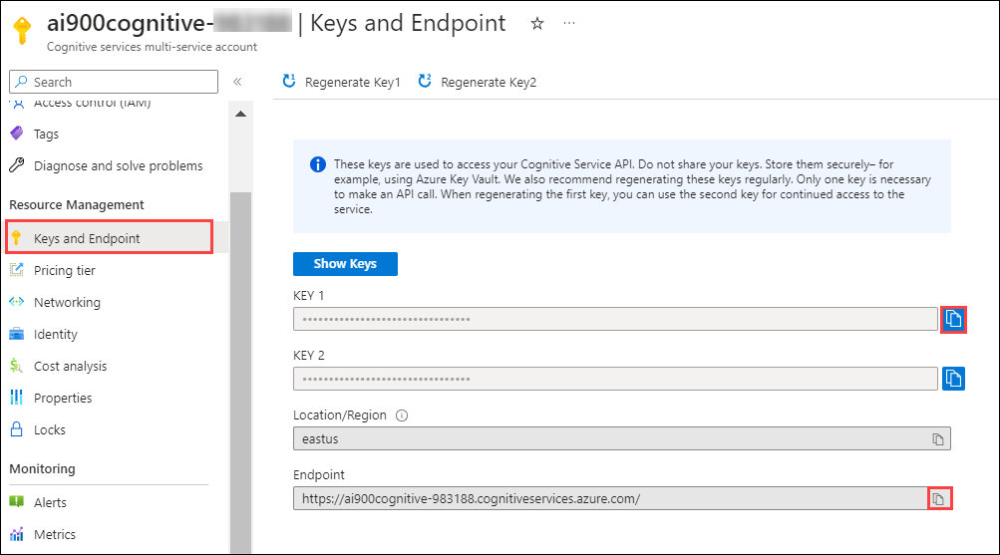

### Task 2: Run Cloud Shell

To test the capabilities of the Custom Vision service, we'll use a simple command-line application that runs in the Cloud Shell on Azure.

1. In the Azure portal, select the **[>_]** (*Cloud Shell*) button at the top of the page to the right of the search box. This opens a Cloud Shell pane at the bottom of the portal. 

    

1. The first time you open the Cloud Shell, you may be prompted to choose the type of shell you want to use (*Bash* or *PowerShell*). Select **PowerShell**. If you do not see this option, skip the step.

   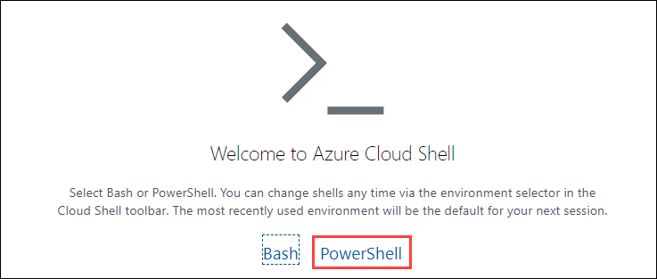

1. If you are prompted to create storage for your Cloud Shell, ensure your subscription is selected and click on **show advanced settings
  
   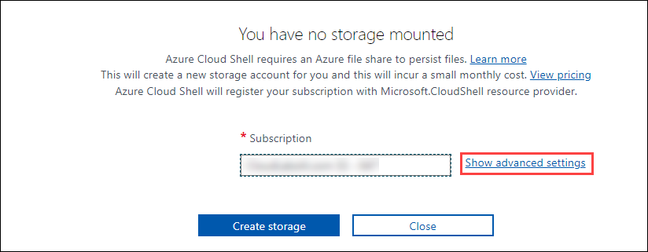
   
1.  Please make sure you have selected your resource group **AI-900-Module-04-<inject key="DeploymentID" enableCopy="false"/> (1)** and enter **blob<inject key="DeploymentID" enableCopy="false"/> (2)** for the **Storage account name** and enter **blobfileshare<inject key="DeploymentID" enableCopy="false"/> (3)** For the **File share name**, then click on **Create Storage (4)**.

    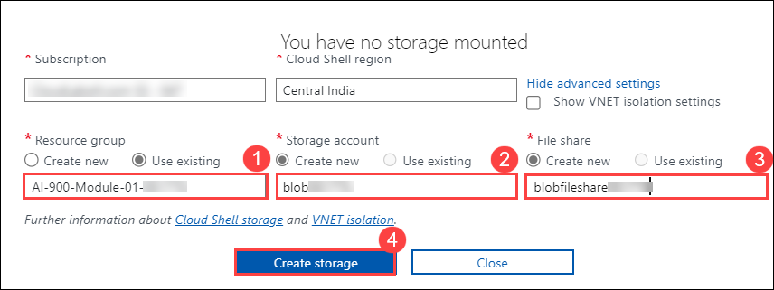

1. Make sure the type of shell indicated on the top left of the Cloud Shell pane is switched to *PowerShell*. If it is *Bash*, switch to *PowerShell* by using the drop-down menu.

    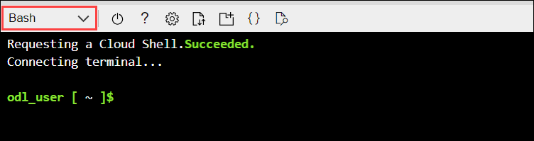 

1. Wait for PowerShell to start. You should see the following screen in the Azure portal:  

    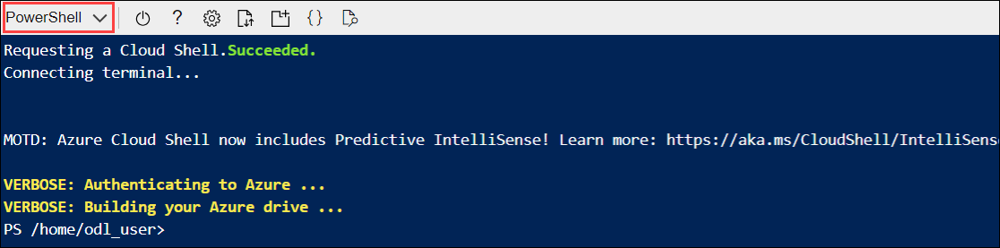 
    
### Task 3: Configure and run a client application

Now that you have a custom model, you can run a simple client application that uses the Language service.

1. In the command shell, enter the following command to download the sample application and save it to a folder called ai-900.

    ```PowerShell
    git clone https://github.com/MicrosoftLearning/AI-900-AIFundamentals ai-900
    ```

1. The files are downloaded to a folder named **ai-900**. Now we want to see all of the files in your Cloud Shell storage and work with them. Type the following command into the shell:

     ```PowerShell
    code .
    ```

    Notice how this opens up an editor like the one in the image below:

    

1. In the **Files** pane on the left, expand **ai-900** and select **analyze-text.ps1**. This file contains some code that uses the Language service:

    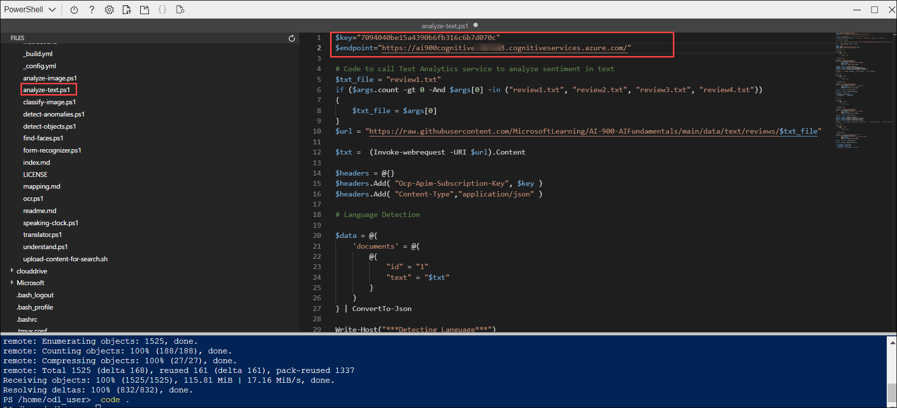

1. Don't worry too much about the details of the code. In the Azure portal, navigate to your Cognitive Services resource. Then select the **Keys and Endpoints** page on the left hand pane. Copy the key and endpoint from the page and paste them into the code editor, replacing the **YOUR_KEY** and **YOUR_ENDPOINT** placeholder values respectively.

    > **Tip:** You may need to use the separator bar to adjust the screen area as you work with the **Keys and Endpoint** and **Editor** panes.

    


1. At the top right of the editor pane, use the **...** button to open the menu and select **Save** to save your changes. Then open the menu again and select **Close Editor**.

    The sample client application will use Cognitive Services' Language service to detect language, extract key phrases, determine sentiment, and extract known entities for reviews.

1. In the Cloud Shell, enter the following command to run the code:

    ```PowerShell
    cd ai-900
    ```
    
    ```PowerShell
    ./analyze-text.ps1 review1.txt
    ```

    You will be reviewing this text:

    >Good Hotel and staff
    The Royal Hotel, London, UK
    3/2/2018
    Clean rooms, good service, great location near Buckingham Palace and Westminster Abbey, and so on. We thoroughly enjoyed our stay. The courtyard is very peaceful and we went to a restaurant that is part of the same group and is Indian ( West Coast so plenty of fish) with a Michelin Star. We had the taster menu which was fabulous. The rooms were very well appointed with a kitchen, lounge, bedroom, and enormous bathroom. Thoroughly recommended.

1. Review the output.

     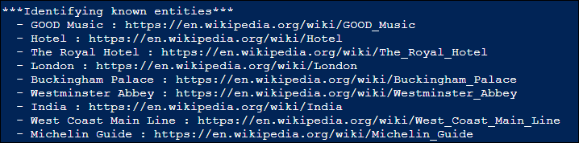

1. In the PowerShell pane, enter the following command to run the code:

    ```PowerShell
    ./analyze-text.ps1 review2.txt
    ```

    You will be reviewing this text:

    >Tired hotel with poor service
    The Royal Hotel, London, United Kingdom
    5/6/2018
    This is an old hotel (has been around since the  1950s) and the room furnishings are average - becoming a bit old now and require changing. The internet didn't work and had to come to one of their office rooms to check in for my flight home. The website says it's close to the British Museum, but it's too far to walk.

1. Review the output
 
   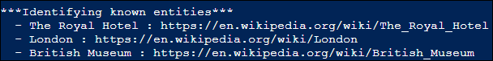

1. In the PowerShell pane, enter the following command to run the code:

    ```PowerShell
    ./analyze-text.ps1 review3.txt
    ```

    You will be reviewing this text:

    >Good location and helpful staff, but on a busy road.
    The Lombard Hotel, San Francisco, USA
    8/16/2018
    We stayed here in August after reading reviews. We were very pleased with the location, just behind Chestnut Street, a cosmopolitan and trendy area with plenty of restaurants to choose from. The
    The Marina district was lovely to wander through, with very interesting houses. Make sure to walk to the San Francisco Museum of Fine Arts and the Marina to get a good view of the Golden Gate Bridge and the city. On a bus route and easy to get into the center. Rooms were clean with plenty of room and the staff were friendly and helpful. The only downside was the noise from Lombard Street so ask to have a room furthest away from traffic noise.

1. Review the output.

     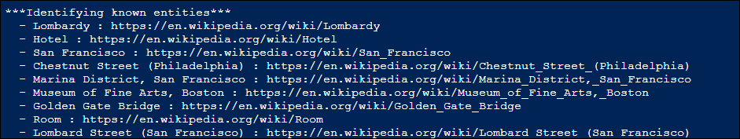

1. In the PowerShell pane, enter the following command to run the code:

    ```PowerShell
    ./analyze-text.ps1 review4.txt
    ```

    You will be reviewing this text:

    >Very noisy and rooms are tiny
    The Lombard Hotel, San Francisco, USA
    9/5/2018
    The hotel is located on Lombard Street which is a very busy SIX-lane street directly off the Golden Gate Bridge. Traffic from early morning until late at night especially on weekends. The noise would not be so bad if rooms were better insulated but they are not. Had to put cotton balls in my ears to be able to sleep--was too tired to enjoy the city the next day. Rooms are TINY. I picked the room because it had two queen size beds--but the room barely had space to fit them. With a family of four in the room it was tight. With all that said, rooms are clean and they've made an effort to update them. The hotel is in the Marina district with lots of good places to eat, within walking distance to Presidio. Maybe a good hotel for young stay-up-late adults on a budget

1. Review the output.

    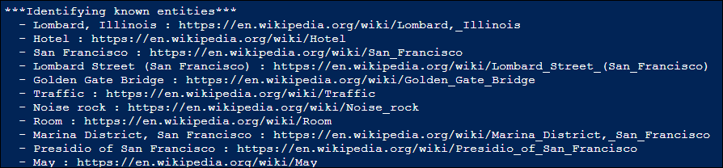
    
   **Congratulations** on completing the task! Now, it's time to validate it. Here are the steps:

   > - Navigate to the Lab Validation tab, from the upper right corner in the lab guide section.
   > - Hit the Validate button for the corresponding task. If you receive a success message, you can proceed to the next task. 
   > - If not, carefully read the error message and retry the step, following the instructions in the lab guide.
   > - If you need any assistance, please contact us at labs-support@spektrasystems.com.

## Learn more

This simple app shows only some of the capabilities of the Language service. To learn more about what you can do with this service, see the [Language service page](https://azure.microsoft.com/services/cognitive-services/language-service/).
