# Module 04d : Explore question answering 
For customer support scenarios, it's common to create a bot that can interpret and answer frequently asked questions through a website chat window, email, or voice interface. Underlying the bot interface is a knowledge base of questions and appropriate answers that the bot can search for suitable responses.

## Exercise 1: Create a custom question-answering knowledge base

## Task 1: Create a custom question-answering knowledge base

The Language service's custom question-answering feature enables you to quickly create a knowledge base, either by entering question-and-answer pairs or from an existing document or web page. It can then use some built-in natural language processing capabilities to interpret questions and find appropriate answers.

1. Click the **&#65291;Create a resource** button, search for **Language service**.

    
   
1. In the Marketplace page search for **Language Services** and Select **Language Services** 

    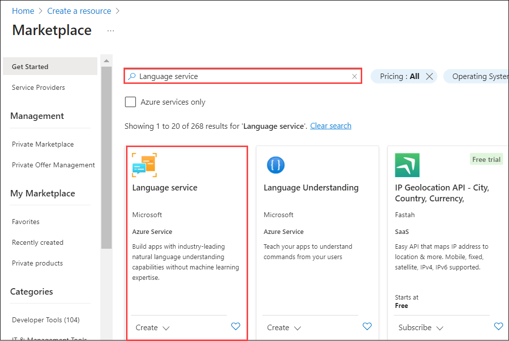
     
1. On Language Services Page Click on **Create**. 

    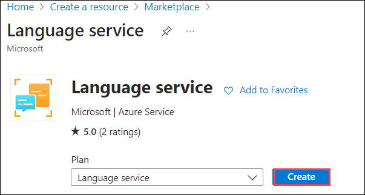
    
1. Create a **Language service** resource with the following settings, and then click **Continue to create your resource**:
    - **Select Additional Features**
    - **Default features**: *Keep the default features*.
    - **Custom features**: *Select custom question answering*.

      

1. On the **Create Language** page, specify the following settings:
    - **Subscription**: Use existing Azure subscription. **(1)**
    - **Resource group**: Select **AI-900-Module-03c-<inject key="DeploymentID" enableCopy="false" /> (2)**.
    - **Region**: Select **<inject key="location" enableCopy="false" /> (3)**
    - **Name**:Enter **ai900language-<inject key="DeploymentID" enableCopy="false"/> (4)**
    - **Pricing tier**: S (1K Calls per minute) **(5)**
    - **Azure Serach region**: Select **<inject key="location" enableCopy="false" /> (6)**
    - **Azure Pricing tier**: **Free F(3 Indexes)**
    - **By checking this box I certify that I have reviewed and acknowledge the terms in the Responsible AI Notice**: **Selected (6)**.
    
      >**Note:** If you have already provisioned a free-tier **Azure Cognitive Search** resource, your quota may not allow you to create another one. In this case, select a tier other than **Free F(3 Indexes)**.

1. Click **Review and Create** and then click **Create**. Wait for the deployment of the Language service that will support your custom question-answering knowledge base.

      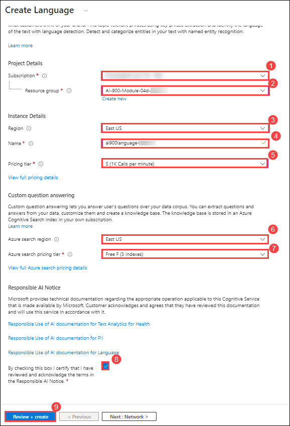

1. In a new browser tab, open the Language Studio portal at [https://language.azure.com](https://language.azure.com?azure-portal=true).

1. Sign in using the following username and password.
    
    * Email/Username: <inject key="AzureAdUserEmail"></inject>
    
    * Password: <inject key="AzureAdUserPassword"></inject>
    
     
     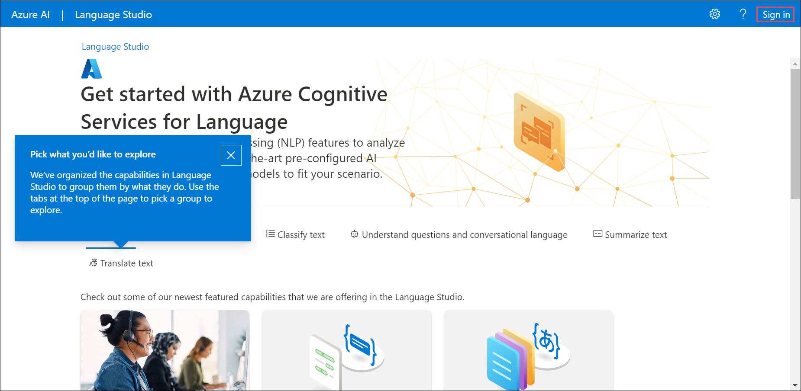

1. If prompted to select an Azure resource, ensure the following settings and click on **Done (5)**:
    - **Azure directory**: The Azure directory containing the pre alloted subscription. **(1)**
    - **Azure subscription**: The default Azure subscription. **(2)**
    - **Resource type**: Language. **(3)**
    - **Resource name**: The Language resource you created previously. **(4)**

      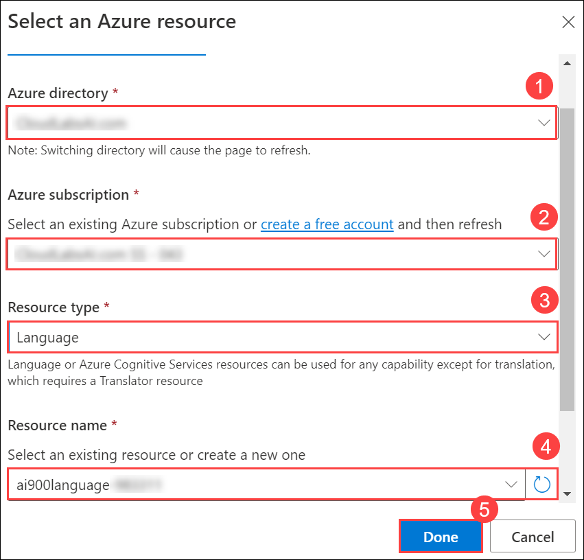
      
1. If you are ***not*** prompted to choose a language resource, it may be because you have multiple Language resources in your subscription; in which case:

     - On the bar at the top of the page, click the **Settings (&#9881;)** button.
     - On the **Settings** page, view the **Resources** tab.
     - Select the language resource you just created, and click **Switch resource**.
     - At the top of the page, click **Language Studio** to return to the Language Studio home page.

1. At the top of the Language Studio portal, in the **Create new** menu, select **Custom question answering**.

     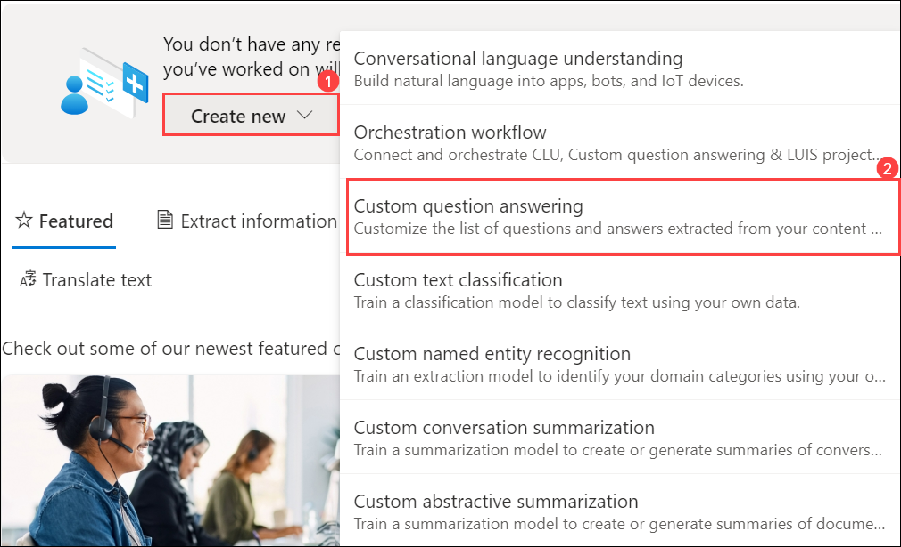

1. On the **Choose language setting for resource ai900language-<inject key="DeploymentID" enableCopy="false" />** page, select **I want to select the language when I create a project in this resource** and click **Next**.

    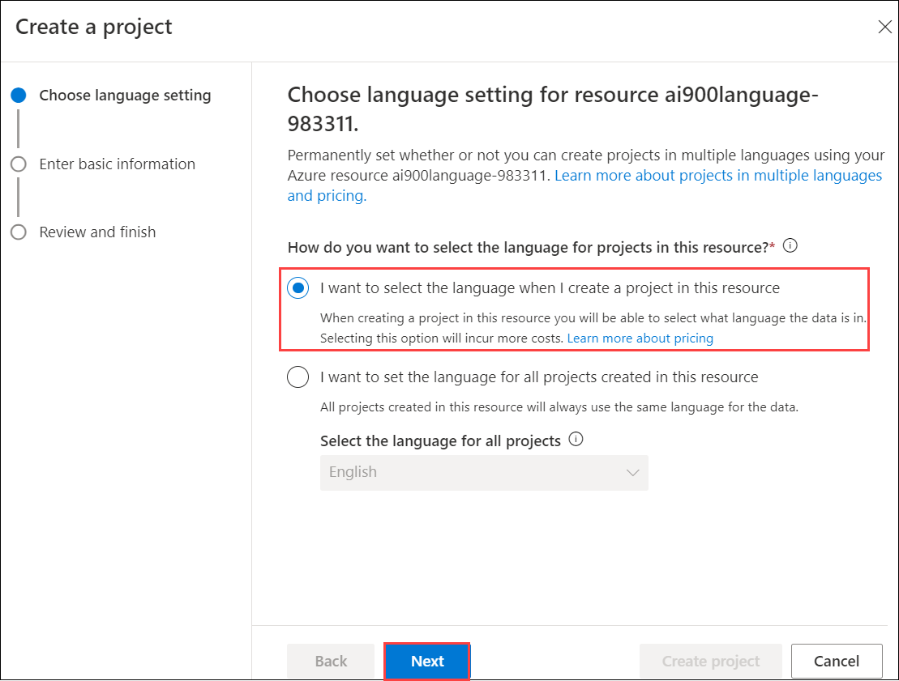

1. If not prompted then on the **Select the project you want to work with** page is empty then click on **Create new project**. Execute the following steps, or else proceed to the **next step**.

    - On **Connect to Azure search** page click on **Connect to Azure search**.
    - On the **Azure Search** page select dropdown of Select Azure Search resources and click on **Add Azure Search resources** 
    - On the  **Create Azure Search** page enter **Azure Search Service Name** and enter the language service you have created earlier you have created **Azure search region:** east us2. **Azure search pricing tier:** Free F (3 Indexes) - (If this tier is not available, select Standard S (50 Indexes)) and click on **Create**.
    - At the top of the page, click **Language Studio** to return to the Language Studio home page.
    - At the top of the Language Studio portal, in the **Create new** menu, select **Custom question answering**.

1. On the **Enter basic information** page, enter the following details and click **Next**:
    - **Language resource**: choose your language resource.  
    - **Azure search resource**: choose your Azure search resource.
    - **Name**: MargiesTravel
    - **Description**: A simple knowledge base
    - **Source language**: English
    - **Default answer when no answer is returned**: No answer found

      

1. On the **Review and finish** page, click **Create project**.

     

1. You will be taken to the **Manage sources** page. Click **&#65291;Add source** and select **URLs**.

    

1. In the **Add URLs** box, click **+ Add url**. Type in the following and select **Add all**:
    - **URL name**: MargiesKB
    - **URL**: `https://raw.githubusercontent.com/MicrosoftLearning/AI-900-AIFundamentals/main/data/qna/margies_faq.docx`
    - **Classify file structure**: Auto-detect

     

### Task 2: Edit the knowledge base

Your knowledge base is based on the details in the FAQ document and some pre-defined responses. You can add custom question-and-answer pairs to supplement these.

1. Click **Edit knowledge base** on the left-hand panel. Then click **+** to add a new question-answer pair.

    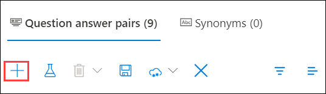

1. In the **Add a new question answer pair** page, set the **Source** to **Editorial**.

1. Within the **Question** box, type `Hello`.

1. In the **Answer** box, type `Hello`.

1. Click **Done**. 

    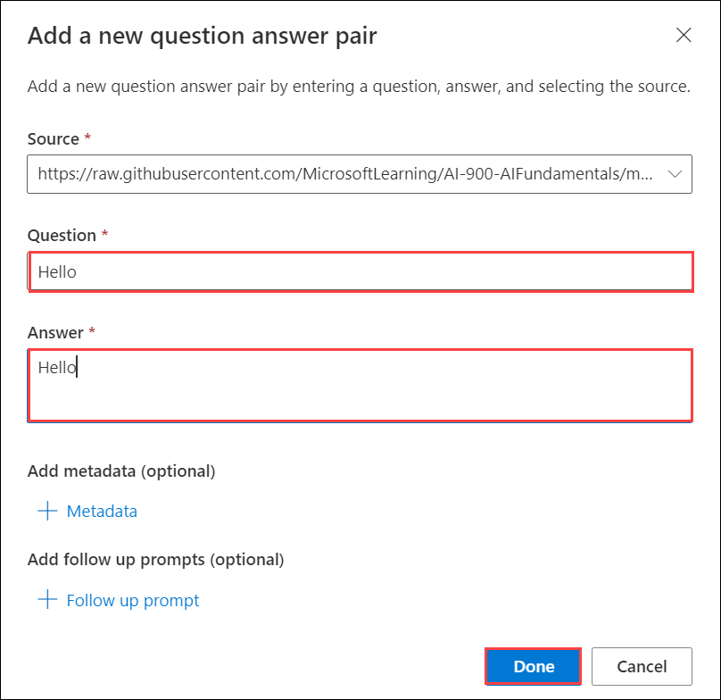
   
1. Then at the top of the page click **Save** to save your changes. You may need to change the size of your window to see the button.
  
     
   
### Task 3: Train and test the knowledge base

Now that you have a knowledge base, you can test it.

1. At the top of the page, click **Test** to test your knowledge base.

    

1. In the test pane, at the bottom enter the message *Hello*. The response **Hello** should be returned.

    

1. In the test pane, at the bottom enter the message **I want to book a flight**. An appropriate response from the FAQ should be returned.

    > **Note :**
    > The response includes a *short answer* as well as a more verbose *answer passage* - the answer passage shows the full text in the FAQ document for the closest matched question, while the short answer is intelligently extracted from the passage. You can control whether the short answer is from the response by using the **Display short answer** checkbox at the top of the test pane.

1. Try another question, such as *How can I cancel a reservation?*

1. When you're done testing the knowledge base, click **Test** to close the test pane.

### Task 4: Create a bot for the knowledge base

The knowledge base provides a back-end service that client applications can use to answer questions through some sort of user interface. Commonly, these client applications are bots. To make the knowledge base available to a bot, you must publish it as a service that can be accessed over HTTP. You can then use the Azure Bot Service to create and host a bot that uses the knowledge base to answer user questions.

1. At the left of the Language Studio page, click **Deploy knowledge base (1)**. At the top of the page, click **Deploy (2)**.

     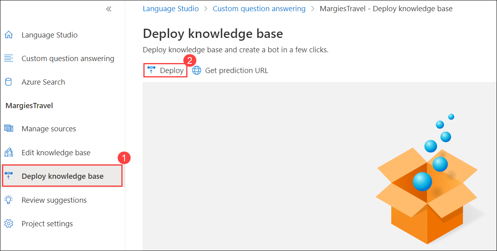      

1. A dialogue box will ask if you want to deploy the project. Select **Deploy**.

1. After the service has been deployed, click **Create a bot**. This opens the Azure portal in a new browser tab so you can create a Web App Bot in your Azure subscription.
 
     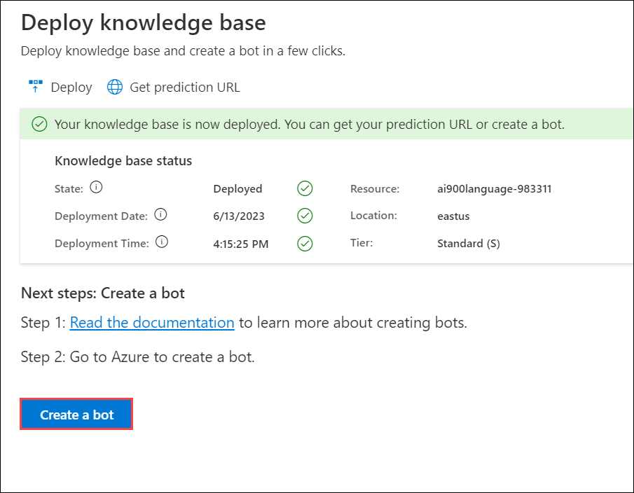

1. In the Azure portal, create a Web App Bot. (You may see a warning message to check that the source of the template is trustworthy. You do not need to take any action for that message.) Continue by updating the following settings:

    - **Project Details**
    
        - **Subscription**: Use existing subscription. **(1)**
        - **Resource group**: Select **AI-900-Module-04d-<inject key="DeploymentID" enableCopy="false"/> (2)**.
        
    - **Instance details**
    
        - **Resource group Location**: Select **<inject key="location" enableCopy="false" /> (3)**.
        
    - **Azure Bot**
    
        - **Bot handle**: *A unique name for your bot* (*pre-populated*) **(4)**
        
    - **Choose your pricing tier**

        - **Pricing tier**: Free (F0) (You may need to select *Change plan*) **(5)**
        
    - **Microsoft App ID**
    
        - **Creation type**: *Select Create new User-assigned managed identity* **(6)**
  
       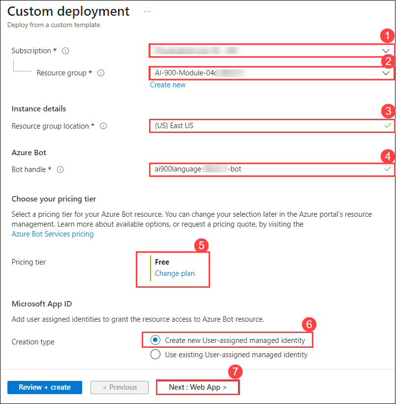

5. Select **Next: Web App >** to continue updating the settings. 

    - **App Service**
    
        - **App name**: *Same as the **Bot handle** with **.azurewebsites.net** appended automatically* 
        - **SDK language**: *Choose either C# or Node.js* 
        
        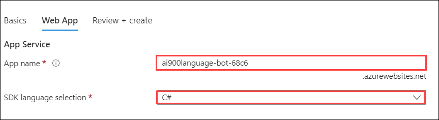
        
    - **App Service Plan**
    
        - **Creation Type**: *Select Create new app service plan*  **(1)**
        
    - **App Settings**
        - **Language Resource Key**: *You will need to copy your Language resource key and paste it here.* **(2)**
        
        > **Note :**
        > To navigate to your Language resource key, open [https://portal.azure.com](https://portal.azure.com?azure-portal=true). On the home page, click on *Resource Groups* and locate the resource group you created for your **Language resource** in. Select your Language resource and navigate to its left-hand menu. Then select **Keys and Endpoint**. Copy one of the keys. 

         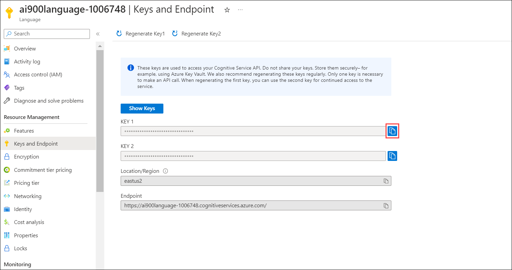
    -  
        - **Language project name**: MargiesTravel **(3)**
        - **Language service endpoint hostname**: *Pre-populated with your language service endpoint* **(4)**
        
    - **Language service details**
    
        - **Subscription Id**: *Pre-populated with your subscription ID* **(5)**
        - **Resource Group Name**: *Pre-populated with your resource group name*  **(6)**
        - **Account Name**: *Pre-populated with your resource name* **(7)**

1. Select **Review + Create (8)**.

    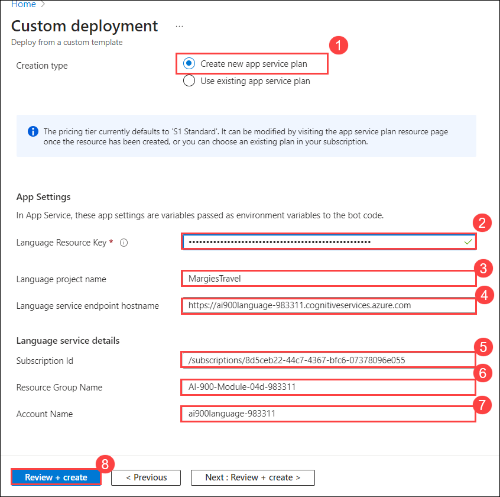

1. Wait for your bot to be created (the notification icon at the top right, which looks like a bell, will be animated while you wait). Then in the notification that deployment has completed, click **Go to resource** (or alternatively, on the home page, click **Resource groups**.

1. Open the resource group where you created the **web app bot**.

1. In the left-hand pane of your bot look for **Settings**, click on **Test in Web Chat**, and wait until the bot displays the message **Hello and Welcome** (it may take a few seconds to initialize).

1. Use the test chat interface to ensure your bot answers questions from your knowledge base as expected. For example, try submitting **How can I book a flight?**.

     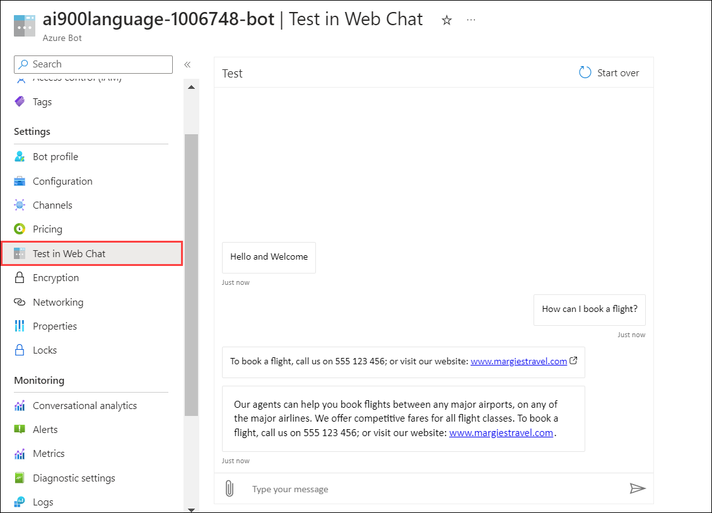

Experiment with the bot. You'll probably find that it can answer questions from the FAQ quite accurately, but it will have limited ability to interpret questions that it has not been trained with. You can always use the Language Studio to edit the knowledge base to improve it and republish it.

**Congratulations** on completing the task! Now, it's time to validate it. Here are the steps:

  > - Navigate to the Lab Validation tab, from the upper right corner in the lab guide section.
  > - Hit the Validate button for the corresponding task. If you receive a success message, you can proceed to the next task. 
  > - If not, carefully read the error message and retry the step, following the instructions in the lab guide.
  > - If you need any assistance, please contact us at labs-support@spektrasystems.com.

### Learn more

- To learn more about the Question Answering service, view [the documentation](https://docs.microsoft.com/azure/cognitive-services/language-service/question-answering/overview).
- To learn more about the Microsoft Bot Service, view [the Azure Bot Service page](https://azure.microsoft.com/services/bot-service/).
