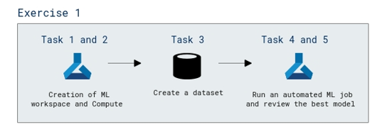

# Lab Scenario Preview: AI-900: 

## Lab 02: Explore Automated Machine Learning in Azure ML

### Lab overview

In this lab, you will use a dataset of historical bicycle rental details to train a model that predicts the number of bicycle rentals that should be expected on a given day, based on seasonal and meteorological features. 

## Objective
  
After completing this lab, you will be able to create an Azure Machine Learning workspace

## Architecture Diagram

  
