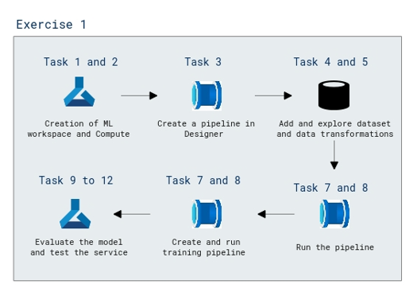

# Lab Scenario Preview: AI-900: Explore visual tools for machine learning

## Lab 02a: Explore regression with Azure Machine Learning Designer

### Lab overview

In this lab, you will train a regression model that predicts the price of an automobile based on its characteristics.

## Objective
  
After completing this lab, you will be able to create an Azure Machine Learning workspace

## Architecture Diagram

 
