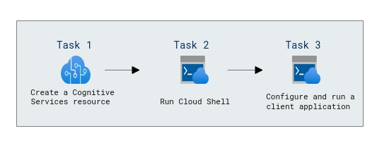

# Lab Scenario Preview: AI-900: 

## Lab 03: Explore Computer Vision

### Lab overview

In this lab, you'll use a simple command-line application to see the Computer Vision service in action. The same principles and functionality apply in real-world solutions, such as web sites or phone apps. 

## Objectives
  
After completing this lab, you will be able to:

- Create Azure Cognitive Services and Azure Storage Account.
- Configure and run a client application.

## Architecture Diagram

  
