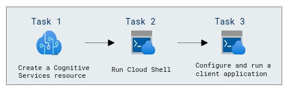

# Lab Scenario Preview: AI-900: Explore computer vision

## Lab 03d:  Explore Face Recognition

### Lab overview

In this lab, you will test the capabilities of of the Face service, we'll use a simple command-line application that runs in the Cloud Shell.

## Objectives
  
After completing this lab, you will be able to:

- Create a Face API resource and a Azure Storage Account.
- Configure and run a client application.

## Architecture Diagram

  
