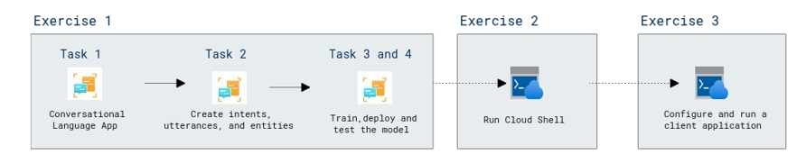

# Lab Scenario Preview: AI-900: Explore natural language processing

## Lab 04c: Explore Language Understanding

### Lab overview

In this lab, you will test the capabilities of the Conversational Language Understanding service, we'll use a command-line application that runs in the Cloud Shell. 

## Objectives
  
After completing this lab, you will be able to:

- Create and use a Language Service resource.
- Configure and run a client application.

## Architecture Diagram

   
