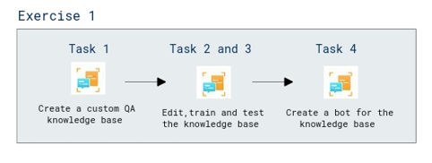

# Lab Scenario Preview: AI-900: Explore natural language processing

## Lab 04d: Explore Question Answering

### Lab overview

In this lab, you will learn about Language service's custom question-answering feature.

## Objectives
  
After completing this lab, you will be able to create a custom question-answering knowledge base.

## Architecture Diagram

  
