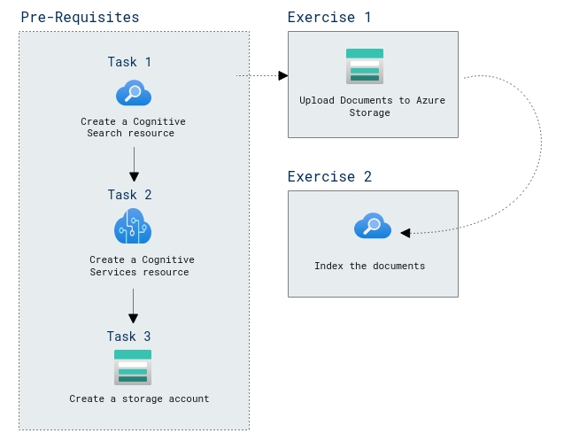

# Lab Scenario Preview: AI-900: 

## Lab 5: Explore Knowledge Mining

### Lab overview

In this lab, you will learn about building an Azure Cognitive Search index using data extracted from customer reviews.

## Objectives
  
After completing this lab, you will be able to:

- Create Azure resources
- Extract data from a data source

## Architecture Diagram

   
